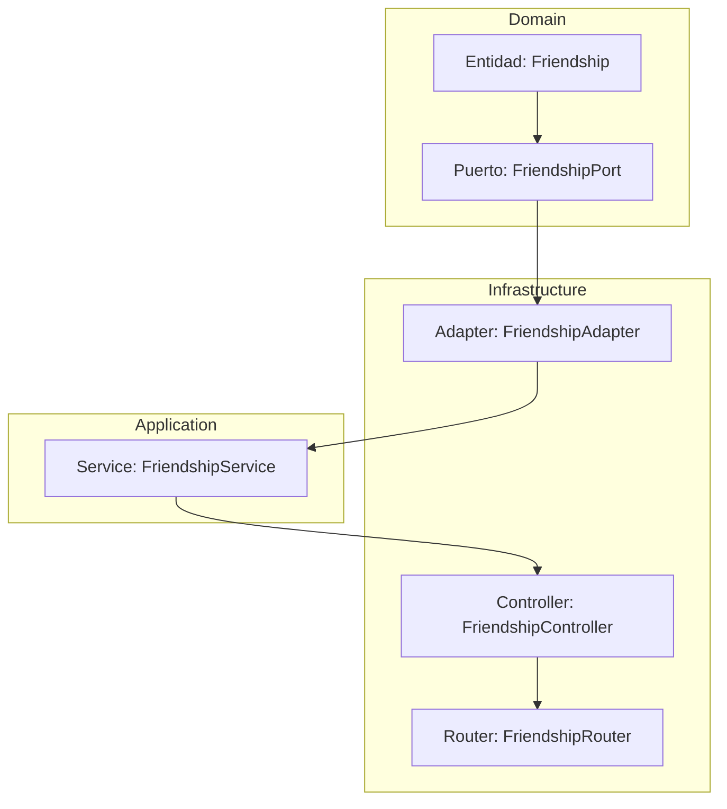

# Guia paso para crear los endpoints

## Capa de dominio

### Definición de el modelo

1. En la capa dominio en `src/domain` crear el modelo necesario en la carpeta models, usar la nomenclatura camel case, que es hacerlo sin guión y poniendo mayúsculas, por ejemplo `EstadioDeFutbol.ts.`
2. Crear la interfaz/clase/type requerida, declarando las propiedades necesarias con sus tipos. No agregar nada de más que no tenga que ver con lo que se le puso el nombre al archivo. Por ejemplo

```
export default interface EstadioDeFutbol{
  id: number;
  direccion: string;
  cupo: number
  nombre: string;
}
```

### Definición de el puerto

3. En la carpeta `ports/data` o `ports/utils` dependiendo de la función, crear el puerto con la nomenclatura anterior y agregándole el port al final, por ejemplo `EstadioDeFutbolPort.ts`
4. Crear la interfaz con las funciones necesarias declarando el tipo de valor que va a recibir y el tipo de variable que va a retornar, preferiblemente `Promise<ApplicationResponse<TipoDelDato>>`. Por ejemplo

```
export default interface EstadioDeFutbolPort {
  crearEstadio(estadio: EstadioDeFutbol): Promise<ApplicationResponse<number>>
}
```

## Capa de infrastructura

### Creación de el adaptador

5. En la capa infrastructure en `src/infrastructure` en la carpeta adapter crear el adaptador del puerto, por ejemplo `EstadioDeFutbolAdapter.ts`
6. En el archivo crear la clase que implemente el adaptador, por ejemplo

```
export default class EstadioDeFutbolAdapter implements EstadioDeFutbolPort {
}
```

> Va a lanzar un error ya que no está implementando correctamente todos los métodos, pararse sobre el nombre de la clase y con vscode implementar los métodos. Saldrá algo así

```
export default class EstadioDeFutbolAdapter implements EstadioDeFutbolPort {
 crearEstadio(estadio: EstadioDeFutbol): Promise<ApplicationResponse<number>>{
  throw new NotImplementedMethod("")
 }
}
```

7. Dentro de las funciones que trajo de el puerto, agregar la lógica correspondiente.

## Capa de aplicación

### Creación del servicio

#### Inyección de dependencias

8. Ahora en la capa de application en `src/application` en la carpeta services crear el servicio necesario, por ejemplo `UserService.ts`
9. En el servicio crear la clase , inyectando los puertos necesarios, por ejemplo

```
export default class EstadioDeFutbolService {
	private estadioPort: EstadioDeFutbolPort;

	constructor(estadioPort: EstadioDeFutbolPort){
		this.estadioPort = estadioPort;
	}
}

```

#### Implementación de los puertos

10. En el servicio, crear las funciones necesarias para el funcionamiento, pueden ser llamadas iguales o parecidas a las del puerto, o distintas también. Ejemplo

```
export default class EstadioDeFutbolService {
	private estadioPort: EstadioDeFutbolPort;

	constructor(estadioPort: EstadioDeFutbolPort){
		this.estadioPort = estadioPort;
	}

	async crearEstadio(estadio: EstadioDeFutbol): Promise<ApplicationResponse<number>>{
    if (!estadio) {
      return ApplicationResponse.failure(new ApplicationError("Se necesita un estadio para crearlo", ErrorCodes.REQUIRED_FIELD));
    }
		try {
      const responseEstadio = await this.estadioPort.crearEstadio(estadio);

      if (!responseEstadio.success) {
        return ApplicationResponse.failure(new ApplicationError("Se necesita un estadio para crearlo", ErrorCodes.REQUIRED_FIELD));
      }
      return ApplicationResponse.success(responseEstadio.id)
    } catch (error) {
      console.error(error);
      throw error;
    }
	}
}

```

## Capa de infraestructura

### Creación de el controller

11. Ahora en la capa de infrastructure en la carpeta services crear el controller necesario en la carpeta `controller`, por ejemplo `EstadioDeFutbolController.ts`
12. En el controller crear la clase e implementar los servicios a usar, por ejemplo:

```
export default class EstadioDeFutbolController {
  private estadioService: EstadioDeFutbolService;

  constructor(estadioService: EstadioDeFutbolService){
    this.estadioService = estadioService;
  }
}
```

13. Crear la función especifica para cada caso de uso. Ejemplo:

```
//Importante hacer las importaciones de express
import { Request, Response } from "express";

export default class EstadioDeFutbolController {
  private estadioService: EstadioDeFutbolService;

  constructor(estadioService: EstadioDeFutbolService){
    this.estadioService = estadioService;
  }

  async registrarEstadioNuevo(req: Request, res: Response) {
    try {
      //el req.body es para traer el cuerpo de la solicitud
      const estadio: EstadioDeFutbol = req.body;
      const response = await this.estadioService.crearEstadio(estadio);

      if (response.success) {
        return res.status(201).json({message: `Se creo correctamente el estadio, quedo con un id ${response.data}`})'
      }
      return res.status(400).json({message: "Ocurrio un error al crear el estadio"})
    } catch (error) {
      return res.status(400).json({message: "Ocurrio un error al crear el estadio"})
    }
  }
}

```

### Creación de la ruta

14. Ya casi por ultimo en la carpeta `router` se crea el archivo que enruta el crud correspondiente por ejemplo: `EstadioDeFutbolRouter.ts`
15. Y para finalizar, en el archivo se agrega el router y se agregan las rutas correspondientes. Ejemplo (me dio ya pereza hacer un ejemplo nuevo asi que este es el de la aplicacion como tal, pero igual creo que se entiende)

```
import { Request, Response, Router } from "express";
import UserAdapter from "../adapter/data/UserAdapter";
import UserService from "../../application/services/UserService";
import AuthService from "../../application/services/AuthService";
import UserController from "../controller/UserController";
import AuthAdapter from "../adapter/data/AuthAdapter";
import EmailNodemailerAdapter from "../adapter/utils/EmailAdapter";
import LoggerAdapter from "../adapter/utils/LoggerAdapter";
import TokenAdapter from "../adapter/utils/TokenAdapter";

// import DataNotFoundError from "../shared/errors/DataNotFoundError";

//Express
const router = Router();
//Inicializacion de capas
const userAdapter = new UserAdapter();
const authAdapter = new AuthAdapter();
const loggerAdapter = new LoggerAdapter();
const tokenAdapter = new TokenAdapter();
const emailAdapter = new EmailNodemailerAdapter(loggerAdapter);
const userApp = new UserService(
  userAdapter,
  authAdapter,
  emailAdapter,
  loggerAdapter,
  tokenAdapter,
);
const authService = new AuthService(userAdapter, authAdapter, emailAdapter, loggerAdapter);
const userController = new UserController(userApp, authService);

//Login
router.post("/login", async (req: Request, res: Response) => {
  try {
    await userController.loginUser(req, res);
  } catch (error: any) {
    console.error("Error en login: ", error);
    res.status(500).json({ message: "Error en el login del usuario" });
  }
});

router.get("/ping", async (request, response: Response) => {
  response.status(200).json({ message: "pong" });
});

//Definicion de rutas o endopoints
router.post("/user", async (request, response) => {
  try {
    await userController.registerUser(request, response);
  } catch (error: any) {
    console.error("Error en usuario: ", error);
    response.status(500).json({ message: "Error en la creacion del usuario" });
  }
});


router.get("/users", async (req, res) => {
  try {
    await userController.getAllUsers(req, res);
  } catch (error: any) {
    const errorMessage = error.message ?? "Error al traer los usuarios";
    res.status(error.statusCode ?? 500).json({
      message: errorMessage,
    });
    console.error(errorMessage, error);
  }
});

router.get("/users/id/:id", async (req, res) => {
  try {
    await userController.getUserById(req, res);
  } catch (error: any) {
    const errorMessage = error.message ?? "Error al traer el usuario";
    res.status(error.statusCode ?? 500).json({
      message: errorMessage,
    });
    console.error(errorMessage, error);
  }
});
router.get("/users/email/:email", async (req, res) => {
  try {
    await userController.getUserByEmail(req, res);
  } catch (error: any) {
    const errorMessage = error.message ?? "Error al traer el usuario";
    res.status(error.statusCode ?? 500).json({
      message: errorMessage,
    });
    console.error(errorMessage, error);
  }
});

router.put("/users/:id", async (req, res) => {
  try {
    await userController.updateUser(req, res);
  } catch (error: any) {
    const errorMessage: string = error.message ?? "Error al actualizar el usuario";
    res.status(error.statusCode ?? 500).json({
      message: errorMessage,
    });
    console.error(errorMessage, error);
  }
});

router.delete("/user/:id", async (req, res) => {
  try {
    await userController.logicalDeleteUser(req, res);
  } catch (error: any) {
    const errorMessage = error.message ?? "Error al eliminar el usuario";
    res.status(error.statusCode ?? 500).json({
      message: errorMessage,
    });
    console.error(errorMessage, error);
    res.status(400).json({
      message: errorMessage,
    });
  }
});

// Ruta para recuperar contraseña
router.post("/forgot-password", async (req, res) => {
  try {
    await userController.forgotPassword(req, res);
  } catch (error: any) {
    const errorMessage = error.message ?? "Error al procesar la recuperación de contraseña";
    res.status(error.statusCode ?? 500).json({
      message: errorMessage,
    });
    console.error(errorMessage, error);
  }
});

// Ruta para restablecer contraseña
router.post("/reset-password", async (req, res) => {
  try {
    await userController.resetPassword(req, res);
  } catch (error: any) {
    const errorMessage = error.message ?? "Error al restablecer la contraseña";
    res.status(error.statusCode ?? 500).json({
      message: errorMessage,
    });
    console.error(errorMessage, error);
  }
});

// Ruta para verificar email
router.post("/verify-email", async (req, res) => {
  try {
    await userController.verifyEmail(req, res);
  } catch (error: any) {
    const errorMessage = error.message ?? "Error al verificar el email";
    res.status(error.statusCode ?? 500).json({
      message: errorMessage,
    });
    console.error(errorMessage, error);
  }
});

export default router;

```


## Ejemplo Práctico: Sistema de Amistades

A continuación se muestra un ejemplo completo de implementación de un sistema de amistades siguiendo la arquitectura hexagonal.

### 1. Modelo de Dominio (Friendship.ts)

```typescript
export enum FrienshipStatus {
  PENDING = "PENDING",
  ACCEPTED = "ACCEPTED",
  REJECTED = "REJECTED",
}

export default interface Friendship {
  id: number;
  from_user_id: number;
  to_user_id: number;
  status: FrienshipStatus;
  created_at: Date;
  updated_at: Date;
}
```

### 2. Puerto de Dominio (FriendshipPort.ts)

```typescript
import Friendship, { FrienshipStatus } from "../models/Friendship";

export default interface FriendshipPort {
  createFriendship(friendship: Friendship): Promise<Friendship>;
  getFriendship(from_user_id: number, to_user_id: number): Promise<Friendship | null>;
  getFriendshipById(id: number): Promise<Friendship | null>;
  updateFriendshipStatus(id: number, status: FrienshipStatus): Promise<Friendship>;
  deleteFriendship(from_user_id: number, to_user_id: number): Promise<void>;
  deleteFriendshipById(id: number): Promise<void>;
  getUserFriendships(userId: number): Promise<Friendship[]>;
}
```

### 3. Adaptador de Infraestructura (FriendshipAdapter.ts)

```typescript
import { AppDataSource } from "../../config/datasources/typeormDatasource";
import Friendship, { FrienshipStatus } from "../../../domain/models/Friendship";
import FriendshipPort from "../../../domain/ports/data/FriendshipPort";
import FriendshipEntity from "../../entities/FriendshipEntity";

export default class FriendshipAdapter implements FriendshipPort {
  async createFriendship(friendship: Friendship): Promise<Friendship> {
    const friendshipRepository = AppDataSource.getRepository(FriendshipEntity);
    const newFriendship = friendshipRepository.create(friendship);
    await friendshipRepository.save(newFriendship);
    return newFriendship;
  }

  async getFriendship(from_user_id: number, to_user_id: number): Promise<Friendship | null> {
    const friendshipRepository = AppDataSource.getRepository(FriendshipEntity);
    const friendship = await friendshipRepository.findOne({
      where: [
        { from_user_id, to_user_id },
        { from_user_id: to_user_id, to_user_id: from_user_id },
      ],
    });
    return friendship || null;
  }

  async getFriendshipById(id: number): Promise<Friendship | null> {
    const friendshipRepository = AppDataSource.getRepository(FriendshipEntity);
    const friendship = await friendshipRepository.findOne({
      where: { id },
    });
    return friendship || null;
  }

  async updateFriendshipStatus(id: number, status: FrienshipStatus): Promise<Friendship> {
    const friendshipRepository = AppDataSource.getRepository(FriendshipEntity);
    await friendshipRepository.update(id, { status });
    const updatedFriendship = await friendshipRepository.findOne({
      where: { id },
    });

    if (!updatedFriendship) {
      throw new Error("Friendship not found");
    }

    return updatedFriendship;
  }

  async deleteFriendship(from_user_id: number, to_user_id: number): Promise<void> {
    const friendshipRepository = AppDataSource.getRepository(FriendshipEntity);
    await friendshipRepository.delete({
      where: [
        { from_user_id, to_user_id },
        { from_user_id: to_user_id, to_user_id: from_user_id },
      ],
    });
  }

  async deleteFriendshipById(id: number): Promise<void> {
    const friendshipRepository = AppDataSource.getRepository(FriendshipEntity);
    await friendshipRepository.delete(id);
  }

  async getUserFriendships(userId: number): Promise<Friendship[]> {
    const friendshipRepository = AppDataSource.getRepository(FriendshipEntity);
    const friendships = await friendshipRepository.find({
      where: [{ from_user_id: userId }, { to_user_id: userId }],
    });
    return friendships;
  }
}
```

### 4. Servicio de Aplicación (FriendshipService.ts)

```typescript
import { FrienshipStatus } from "../../domain/models/Friendship";
import FriendshipPort from "../../domain/ports/data/FriendshipPort";
import LoggerPort from "../../domain/ports/utils/LoggerPort";
import UserPort from "../../domain/ports/data/UserPort";

export default class FriendshipService {
  private friendshipPort: FriendshipPort;
  private loggerPort: LoggerPort;
  private userPort: UserPort;

  constructor(friendshipPort: FriendshipPort, loggerPort: LoggerPort, userPort: UserPort) {
    this.friendshipPort = friendshipPort;
    this.loggerPort = loggerPort;
    this.userPort = userPort;
  }

  async createNewFriendship(from_user_id: number, to_user_id: number) {
    try {
      // Validar que los usuarios existen
      const fromUser = await this.userPort.getUserById(from_user_id);
      const toUser = await this.userPort.getUserById(to_user_id);

      if (!fromUser) {
        return { success: false, message: "El usuario remitente no existe" };
      }

      if (!toUser) {
        return { success: false, message: "El usuario destinatario no existe" };
      }

      // Validar que no es el mismo usuario
      if (from_user_id === to_user_id) {
        return { success: false, message: "No puedes enviarte una solicitud a ti mismo" };
      }

      // Verificar si ya existe una amistad
      const existingFriendship = await this.friendshipPort.getFriendship(from_user_id, to_user_id);

      if (existingFriendship) {
        return { success: false, message: "Ya existe una relación entre estos usuarios" };
      }

      // Crear nueva solicitud de amistad
      const newFriendship = await this.friendshipPort.createFriendship({
        id: 0, // Se asigna en la base de datos
        from_user_id,
        to_user_id,
        status: FrienshipStatus.PENDING,
        created_at: new Date(),
        updated_at: new Date(),
      });

      return { success: true, friendship: newFriendship };
    } catch (error) {
      this.loggerPort.error("Error creating friendship", error);
      return { success: false, message: "Error al crear la amistad" };
    }
  }

  async aceptFriendship(from_user_id: number, to_user_id: number) {
    try {
      const friendship = await this.friendshipPort.getFriendship(from_user_id, to_user_id);

      if (!friendship) {
        return { success: false, message: "La solicitud de amistad no existe" };
      }

      if (friendship.status !== FrienshipStatus.PENDING) {
        return {
          success: false,
          message: `No se puede aceptar una solicitud con estado ${friendship.status}`,
        };
      }

      const updatedFriendship = await this.friendshipPort.updateFriendshipStatus(
        friendship.id,
        FrienshipStatus.ACCEPTED,
      );

      return { success: true, friendship: updatedFriendship };
    } catch (error) {
      this.loggerPort.error("Error accepting friendship", error);
      return { success: false, message: "Error al aceptar la amistad" };
    }
  }

  async rejectFriendship(from_user_id: number, to_user_id: number) {
    try {
      const friendship = await this.friendshipPort.getFriendship(from_user_id, to_user_id);

      if (!friendship) {
        return { success: false, message: "La solicitud de amistad no existe" };
      }

      if (friendship.status !== FrienshipStatus.PENDING) {
        return {
          success: false,
          message: `No se puede rechazar una solicitud con estado ${friendship.status}`,
        };
      }

      const updatedFriendship = await this.friendshipPort.updateFriendshipStatus(
        friendship.id,
        FrienshipStatus.REJECTED,
      );

      return { success: true, friendship: updatedFriendship };
    } catch (error) {
      this.loggerPort.error("Error rejecting friendship", error);
      return { success: false, message: "Error al rechazar la amistad" };
    }
  }
}
```

### 5. Controlador (FriendshipController.ts)

```typescript
import { Request, Response } from "express";
import FriendshipService from "../../application/services/FriendshipService";
import ApplicationReponse from "../../application/shared/ApplicationReponse";

export default class FriendshipController {
  private friendshipService: FriendshipService;

  constructor(friendshipService: FriendshipService) {
    this.friendshipService = friendshipService;
  }

  async createFriendship(req: Request, res: Response) {
    const { from_user_id, to_user_id } = req.body;

    const result = await this.friendshipService.createNewFriendship(from_user_id, to_user_id);

    if (result.success) {
      res.status(201).json(ApplicationReponse.success(result.friendship));
    } else {
      res.status(400).json(ApplicationReponse.error(result.message));
    }
  }

  async acceptFriendship(req: Request, res: Response) {
    const { from_user_id, to_user_id } = req.body;

    const result = await this.friendshipService.aceptFriendship(from_user_id, to_user_id);

    if (result.success) {
      res.status(200).json(ApplicationReponse.success(result.friendship));
    } else {
      res.status(400).json(ApplicationReponse.error(result.message));
    }
  }

  async rejectFriendship(req: Request, res: Response) {
    const { from_user_id, to_user_id } = req.body;

    const result = await this.friendshipService.rejectFriendship(from_user_id, to_user_id);

    if (result.success) {
      res.status(200).json(ApplicationReponse.success(result.friendship));
    } else {
      res.status(400).json(ApplicationReponse.error(result.message));
    }
  }
}
```

### 6. Router (FriendshipRouter.ts)

```typescript
import express, { Router } from "express";
import FriendshipController from "../controller/FriendshipController";
import authMiddleware from "../middleware/authMiddleware";

const router: Router = express.Router();

export default function FriendshipRouter(friendshipController: FriendshipController): Router {
  // Middleware de autenticación para todas las rutas
  router.use(authMiddleware);

  // Crear solicitud de amistad
  router.post("/", async (req, res) => {
    try {
      await friendshipController.createFriendship(req, res);
    } catch (error: any) {
      const errorMessage = error.message ?? "Error al crear amistad";
      res.status(500).json({
        message: errorMessage,
      });
      console.error(errorMessage, error);
    }
  });

  // Aceptar solicitud de amistad
  router.put("/accept", async (req, res) => {
    try {
      await friendshipController.acceptFriendship(req, res);
    } catch (error: any) {
      const errorMessage = error.message ?? "Error al aceptar amistad";
      res.status(500).json({
        message: errorMessage,
      });
      console.error(errorMessage, error);
    }
  });

  // Rechazar solicitud de amistad
  router.put("/reject", async (req, res) => {
    try {
      await friendshipController.rejectFriendship(req, res);
    } catch (error: any) {
      const errorMessage = error.message ?? "Error al rechazar amistad";
      res.status(500).json({
        message: errorMessage,
      });
      console.error(errorMessage, error);
    }
  });

  return router;
}
```

### 7. Diagrama de Arquitectura del Sistema de Amistades


