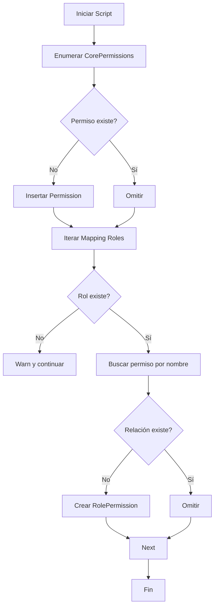

# Guía de Permisos y Autorización

Esta guía describe el modelo de permisos, endpoints disponibles para gestionar permisos y asignaciones a roles, así como el middleware de autorización incorporado.

## Objetivos

- Centralizar acciones sensibles en un catálogo de permisos.
- Asignar permisos a roles (many-to-many).
- Inyectar `roles` y `permissions` al JWT en login para validaciones rápidas.
- Proteger endpoints usando middleware `requirePermissions`.

## Modelo

### Entidades

| Entidad        | Tabla              | Campos Principales                                |
| -------------- | ------------------ | ------------------------------------------------- |
| Permission     | `permissions`      | `id`, `name` (único), `description`, `created_at` |
| RolePermission | `role_permissions` | `id`, `role_id`, `permission_id`, `created_at`    |

`name` es un identificador estable en formato `recurso.acción` (ej: `artist.accept`).

### Enum Base (`CorePermission`)

```ts
// Artist management
artist.create;
artist.update;
artist.delete;
artist.accept;
artist.reject;
// User management
user.read;
user.update;
user.delete;
// Role management
role.read;
role.create;
role.update;
role.delete;
role.assign;
// Permission management
permission.read;
permission.create;
permission.update;
permission.delete;
role - permission.assign;
```

### Mapeo por Defecto (`DefaultRolePermissionMapping`)

| Rol           | Permisos (resumen)                 |
| ------------- | ---------------------------------- |
| `admin`       | TODOS los permisos listados arriba |
| `artist`      | `artist.update`, `user.read`       |
| `common_user` | `user.read`                        |

> Nota: El seeding automático de estos permisos puede implementarse opcionalmente (no obligatorio en esta fase). Si se añade, asegúrate de hacerlo idempotente.

## Flujo de Autenticación / Autorización

1. Usuario hace login (`/login`).
2. El servicio obtiene roles del usuario y, a partir de ellos, las permissions asociadas.
3. El JWT incluye:
   ```json
   {
     "id": 1,
     "username": "demo",
     "roles": ["common_user", "artist"],
     "permissions": ["user.read", "artist.update"]
   }
   ```
4. Middleware `authenticateToken` valida y adjunta usuario básico a `req`.
5. Middleware `enrichPermissionsFromToken` adjunta `req.user.roles` y `req.user.permissions` (si no estaban ya).
6. Middleware `requirePermissions(...needed)` verifica que TODOS los permisos requeridos estén presentes (403 en caso contrario).

## Endpoints de Permisos

Base Path (montaje): Se exponen bajo el router principal (`/api` asumido en ejemplos).

### Crear Permiso

`POST /api/permissions`

Body:

```json
{ "name": "permission.create", "description": "Crear permisos" }
```

Respuestas:

- `201`: Creado
- `400`: Duplicado o validación

### Listar Permisos

`GET /api/permissions`

Respuestas:

- `200`: `{ data: Permission[] }`
- `500`: Error inesperado

### Actualizar Permiso

`PUT /api/permissions/:id`

Body (parcial):

```json
{ "description": "Descripción actualizada" }
```

Respuestas:

- `200`: OK
- `400`: Error / inexistente

### Eliminar Permiso

`DELETE /api/permissions/:id`

Respuestas:

- `200`: Eliminado lógico / confirmación
- `400`: Error / inexistente

## Endpoints de Role-Permission

### Asignar Permiso a Rol

`POST /api/role-permissions/assign`

Body:

```json
{ "roleId": 2, "permissionId": 5 }
```

Respuestas:

- `200`: Asignado / idempotente
- `400`: Error de validación o ya existente

### Remover Permiso de Rol

`POST /api/role-permissions/unassign`

Body:

```json
{ "roleId": 2, "permissionId": 5 }
```

Respuestas:

- `200`: Removido / idempotente
- `400`: Error / inexistente

### Listar Permisos por Rol

`GET /api/role-permissions/:roleId`

Respuestas:

- `200`: `{ data: Permission[] }`
- `400`: Rol inválido

## Uso del Middleware de Autorización

Ejemplo en `ArtistRouter`:

```ts
router.post(
  "/artists",
  authenticateToken,
  enrichPermissionsFromToken,
  requirePermissions(CorePermission.ARTIST_CREATE),
  controller.create,
);
```

### Reglas

- Si faltan roles o permissions en el token → 401 / 403 según caso.
- Se exige que el usuario tenga TODOS los permisos solicitados (AND lógico).
- Para un OR lógico, encadena múltiples rutas o extiende el middleware según necesidad.

## Recomendaciones de Diseño

1. Mantener nombres estables: cambiar `name` implica migración y re-asignaciones.
2. Usar un seeding idempotente para poblar `CorePermission` + mapping (script SQL o inicializador de arranque).
3. Evitar hardcodear permisos fuera de `CorePermission` para mantener trazabilidad.
4. Documentar nuevos permisos siempre antes de su uso en código.
5. Revisar caché en adaptador (si existe) al añadir/eliminar permisos para reflejar cambios (actualmente in-memory por roles ordenados).

## Ejemplo de Respuesta (Creación de Permiso)

```json
{
  "success": true,
  "message": "Permission created",
  "data": {
    "id": 7,
    "name": "artist.create",
    "description": "Crear artistas",
    "created_at": "2025-09-16T12:34:56.000Z"
  }
}
```

## Errores Comunes

| Código / Caso                          | Motivo                                 | Acción                               |
| -------------------------------------- | -------------------------------------- | ------------------------------------ |
| 400 (create/update) nombre duplicado   | `name` ya existe                       | Usar otro nombre o normalizar lógica |
| 400 (assign) IDs inválidos             | `roleId` o `permissionId` no numéricos | Validar antes de enviar              |
| 400 (unassign) inexistente             | Relación no existe                     | Ignorar o consultar primero          |
| 403 (requirePermissions) falta permiso | Token no contiene permiso requerido    | Asignar permiso al rol o cambiar rol |
| 401 (auth) token inválido/ausente      | No se envió header Authorization       | Iniciar sesión nuevamente            |

## Futuras Extensiones (Sugeridas)

- Auditoría de cambios en `role_permissions`.
- Cache distribuida (Redis) para invalidación consistente.
- Agrupación de permisos por dominio para UI (namespaces).
- Soporte de condiciones (ABAC light) sobre entidades específicas.

## Seeding Automático de Permisos

Se incluye un script idempotente `seedPermissions.ts` para poblar:

1. Todos los permisos definidos en `CorePermission`.
2. Asignaciones rol → permisos según `DefaultRolePermissionMapping`.

### Ejecución

```bash
npm run seed:permissions
```

### Comportamiento

- Inserta solo permisos inexistentes (usa búsqueda por `name`).
- Asigna relaciones faltantes (verifica combinación rol+permiso previamente).
- Emite logs de cada inserción/asignación.
- Si un rol definido en el mapping no existe, registra `warn` y sigue.

### Diagrama (Mermaid) Flujo Seeding



### Casos Re-ejecución

- Seguro re-correrlo cuantas veces sea necesario.
- Útil en pipelines CI antes de correr tests de autorización.

### Extender

- Añadir nuevos permisos: agregarlos en enum y mapping -> volver a ejecutar.
- Remover permisos: eliminar de mapping + borrar manualmente filas obsoletas (script puntual).

### Buenas Prácticas

- Versionar cambios al enum junto a la lógica que hace uso del nuevo permiso.
- Evitar renombrar: preferir deprecación + nuevo permiso.
- Revisar logs de pipeline para confirmar asignaciones críticas.

---

Fin de la Guía de Permisos.
