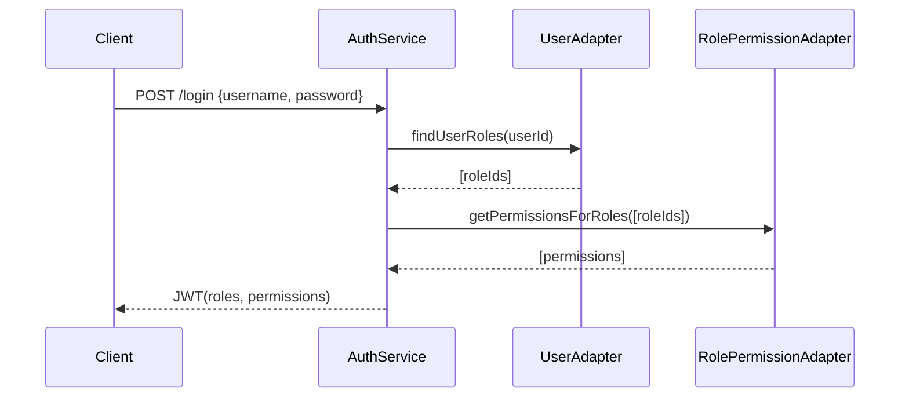
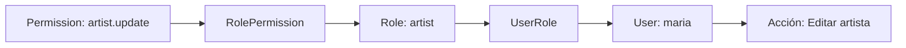

# Guía de Permisos y Autorización

Esta guía describe el modelo de permisos, endpoints disponibles para gestionar permisos y asignaciones a roles, así como el middleware de autorización incorporado.

## Objetivos

- Centralizar acciones sensibles en un catálogo de permisos.
- Asignar permisos a roles (many-to-many).
- Inyectar `roles` y `permissions` al JWT en login para validaciones rápidas.
- Proteger endpoints usando middleware `requirePermissions`.

## Modelo

### Entidades

| Entidad        | Tabla              | Campos Principales                                |
| -------------- | ------------------ | ------------------------------------------------- |
| Permission     | `permissions`      | `id`, `name` (único), `description`, `created_at` |
| RolePermission | `role_permissions` | `id`, `role_id`, `permission_id`, `created_at`    |

`name` es un identificador estable en formato `recurso.acción` (ej: `artist.accept`).

### Enum Base (`CorePermission`)

```ts
// Artist management
artist.create;
artist.update;
artist.delete;
artist.accept;
artist.reject;
// User management
user.read;
user.update;
user.delete;
// Role management
role.read;
role.create;
role.update;
role.delete;
role.assign;
// Permission management
permission.read;
permission.create;
permission.update;
permission.delete;
role - permission.assign;
```

### Mapeo por Defecto (`DefaultRolePermissionMapping`)

| Rol           | Permisos (resumen)                 |
| ------------- | ---------------------------------- |
| `admin`       | TODOS los permisos listados arriba |
| `artist`      | `artist.update`, `user.read`       |
| `common_user` | `user.read`                        |

> Nota: El seeding automático de estos permisos puede implementarse opcionalmente (no obligatorio en esta fase). Si se añade, asegúrate de hacerlo idempotente.

## Flujo de Autenticación / Autorización

1. Usuario hace login (`/login`).
2. El servicio obtiene roles del usuario y, a partir de ellos, las permissions asociadas.
3. El JWT incluye:
   ```json
   {
     "id": 1,
     "username": "demo",
     "roles": ["common_user", "artist"],
     "permissions": ["user.read", "artist.update"]
   }
   ```
4. Middleware `authenticateToken` valida y adjunta usuario básico a `req`.
5. Middleware `enrichPermissionsFromToken` adjunta `req.user.roles` y `req.user.permissions` (si no estaban ya).
6. Middleware `requirePermissions(...needed)` verifica que TODOS los permisos requeridos estén presentes (403 en caso contrario).

## Endpoints de Permisos

Base Path (montaje): Se exponen bajo el router principal (`/api` asumido en ejemplos).

### Crear Permiso

`POST /api/permissions`

Body:

```json
{ "name": "permission.create", "description": "Crear permisos" }
```

Respuestas:

- `201`: Creado
- `400`: Duplicado o validación

### Listar Permisos

`GET /api/permissions`

Respuestas:

- `200`: `{ data: Permission[] }`
- `500`: Error inesperado

### Actualizar Permiso

`PUT /api/permissions/:id`

Body (parcial):

```json
{ "description": "Descripción actualizada" }
```

Respuestas:

- `200`: OK
- `400`: Error / inexistente

### Eliminar Permiso

`DELETE /api/permissions/:id`

Respuestas:

- `200`: Eliminado lógico / confirmación
- `400`: Error / inexistente

## Endpoints de Role-Permission

### Asignar Permiso a Rol

`POST /api/role-permissions/assign`

Body:

```json
{ "roleId": 2, "permissionId": 5 }
```

Respuestas:

- `200`: Asignado / idempotente
- `400`: Error de validación o ya existente

### Remover Permiso de Rol

`POST /api/role-permissions/unassign`

Body:

```json
{ "roleId": 2, "permissionId": 5 }
```

Respuestas:

- `200`: Removido / idempotente
- `400`: Error / inexistente

### Listar Permisos por Rol

`GET /api/role-permissions/:roleId`

Respuestas:

- `200`: `{ data: Permission[] }`
- `400`: Rol inválido

## Uso del Middleware de Autorización

Ejemplo en `ArtistRouter`:

```ts
router.post(
  "/artists",
  authenticateToken,
  enrichPermissionsFromToken,
  requirePermissions(CorePermission.ARTIST_CREATE),
  controller.create,
);
```

### Reglas

- Si faltan roles o permissions en el token → 401 / 403 según caso.
- Se exige que el usuario tenga TODOS los permisos solicitados (AND lógico).
- Para un OR lógico, encadena múltiples rutas o extiende el middleware según necesidad.

## Recomendaciones de Diseño

1. Mantener nombres estables: cambiar `name` implica migración y re-asignaciones.
2. Usar un seeding idempotente para poblar `CorePermission` + mapping (script SQL o inicializador de arranque).
3. Evitar hardcodear permisos fuera de `CorePermission` para mantener trazabilidad.
4. Documentar nuevos permisos siempre antes de su uso en código.
5. Revisar caché en adaptador (si existe) al añadir/eliminar permisos para reflejar cambios (actualmente in-memory por roles ordenados).

## Ejemplo de Respuesta (Creación de Permiso)

```json
{
  "success": true,
  "message": "Permission created",
  "data": {
    "id": 7,
    "name": "artist.create",
    "description": "Crear artistas",
    "created_at": "2025-09-16T12:34:56.000Z"
  }
}
```

## Errores Comunes

| Código / Caso                          | Motivo                                 | Acción                               |
| -------------------------------------- | -------------------------------------- | ------------------------------------ |
| 400 (create/update) nombre duplicado   | `name` ya existe                       | Usar otro nombre o normalizar lógica |
| 400 (assign) IDs inválidos             | `roleId` o `permissionId` no numéricos | Validar antes de enviar              |
| 400 (unassign) inexistente             | Relación no existe                     | Ignorar o consultar primero          |
| 403 (requirePermissions) falta permiso | Token no contiene permiso requerido    | Asignar permiso al rol o cambiar rol |
| 401 (auth) token inválido/ausente      | No se envió header Authorization       | Iniciar sesión nuevamente            |

## Futuras Extensiones (Sugeridas)

- Auditoría de cambios en `role_permissions`.
- Cache distribuida (Redis) para invalidación consistente.
- Agrupación de permisos por dominio para UI (namespaces).
- Soporte de condiciones (ABAC light) sobre entidades específicas.

## Seeding Automático de Permisos

Se incluye un script idempotente `seedPermissions.ts` para poblar:

1. Todos los permisos definidos en `CorePermission`.
2. Asignaciones rol → permisos según `DefaultRolePermissionMapping`.

Adicionalmente, se añadió la migration SQL `001_create_fn_get_mutual_friendships.sql` en `db_querys/` para crear la función de BD que calcula amistades en común.

### Ejecución

```bash
npm run seed:permissions
```

### Comportamiento

- Inserta solo permisos inexistentes (usa búsqueda por `name`).
- Asigna relaciones faltantes (verifica combinación rol+permiso previamente).
- Emite logs de cada inserción/asignación.
- Si un rol definido en el mapping no existe, registra `warn` y sigue.

### Diagrama (Mermaid) Flujo Seeding

````mermaid
flowchart TD
  A[Iniciar Script] --> B[Enumerar CorePermissions]
  B --> C{Permiso existe?}
  C -- No --> D[Insertar Permission]
  C -- Sí --> E[Omitir]
  D --> F[Iterar Mapping Roles]
  E --> F
  F --> G{Rol existe?}
  G -- No --> H[Warn y continuar]
  G -- Sí --> I[Asignar Permiso al Rol]
  H --> J[Próximo Permiso]
  I --> J
  J --> K{Todos los permisos procesados?}
  K -- No --> B
  K -- Sí --> L[Finalizar Script]
````
# Guía de Permisos y Autorización

  Esta guía describe el modelo de permisos, endpoints disponibles para gestionar permisos y asignaciones a roles, así como el middleware de autorización incorporado.

  ## Objetivos

  - Centralizar acciones sensibles en un catálogo de permisos.
  - Asignar permisos a roles (many-to-many).
  - Inyectar `roles` y `permissions` al JWT en login para validaciones rápidas.
  - Proteger endpoints usando middleware `requirePermissions`.

  ## Modelo

  ### Entidades

  | Entidad        | Tabla              | Campos Principales                                |
  | -------------- | ------------------ | ------------------------------------------------- |
  | Permission     | `permissions`      | `id`, `name` (único), `description`, `created_at` |
  | RolePermission | `role_permissions` | `id`, `role_id`, `permission_id`, `created_at`    |

  `name` es un identificador estable en formato `recurso.acción` (ej: `artist.accept`).

  ### Organización por dominio (secciones)

  Para facilitar lectura y asignación en UI, agrupamos permisos por dominio. Cada sección agrupa permisos relacionados con una entidad o feature.

  - **Artist management**: acciones sobre artistas (crear, actualizar, eliminar, aceptar/rechazar solicitud de artista)
  - **User management**: lectura y gestión de usuarios
  - **Role management**: gestión de roles (crear/actualizar/eliminar/leer/assign)
  - **Permission management**: CRUD de permisos y asignaciones

  Esta organización se refleja en el enum `CorePermission` y en la UI de administración.

  ### Enum Base (`CorePermission`) — ejemplo

  ```ts
  // Artist management
  artist.create
  artist.update
  artist.delete
  artist.accept
  artist.reject
  // User management
  user.read
  user.update
  user.delete
  // Role management
  role.read
  role.create
  role.update
  role.delete
  role.assign
  // Permission management
  permission.read
  permission.create
  permission.update
  permission.delete
  role.permission.assign
````

Nota: reemplacé `role - permission.assign` por `role.permission.assign` para mantener un `name` sin espacios y consistente con el formato `recurso.acción`.

### Mapeo por Defecto (`DefaultRolePermissionMapping`)

| Rol           | Permisos (resumen)                 |
| ------------- | ---------------------------------- |
| `admin`       | TODOS los permisos listados arriba |
| `artist`      | `artist.update`, `user.read`       |
| `common_user` | `user.read`                        |

> Nota: El seeding automático de estos permisos puede implementarse opcionalmente. Si se añade, asegúrate de hacerlo idempotente.

## ¿Qué significa cada sección y permiso?

- `artist.*`: Operaciones sobre la entidad `Artist`. Ej: `artist.create` permite crear un artista, `artist.accept` permite al rol aceptar una solicitud de artista.
- `user.*`: Operaciones sobre usuarios; `user.read` permite ver perfiles, `user.update` permite editar datos básicos.
- `role.*` y `permission.*`: Operaciones administrativas para gestionar roles y permisos. `role.permission.assign` es el permiso que permite asignar permisos a un rol (mover una relación permission → role).

Explicación concreta de `role.permission.assign`:

- Propósito: controlar quién puede modificar la relación entre roles y permisos.
- Uso: solo usuarios con este permiso pueden llamar a `POST /api/role-permissions/assign` o la UI de administración que realice esta acción.

## Flujo de Autenticación / Autorización

1. Usuario hace login (`/login`).
2. El servicio obtiene roles del usuario y, a partir de ellos, las permissions asociadas.
3. El JWT incluye:

```json
{
  "id": 1,
  "username": "demo",
  "roles": ["common_user", "artist"],
  "permissions": ["user.read", "artist.update"]
}
```

4. Middleware `authenticateToken` valida y adjunta usuario básico a `req`.
5. Middleware `enrichPermissionsFromToken` adjunta `req.user.roles` y `req.user.permissions` (si no estaban ya).
6. Middleware `requirePermissions(...needed)` verifica que TODOS los permisos requeridos estén presentes (403 en caso contrario).

Diagrama (Sequence - Mermaid): cómo se obtienen permisos en el login



## Endpoints de Permisos

Base Path (montaje): Se exponen bajo el router principal (`/api` asumido en ejemplos).

### Crear Permiso

`POST /api/permissions`

Body:

```json
{ "name": "permission.create", "description": "Crear permisos" }
```

Respuestas:

- `201`: Creado
- `400`: Duplicado o validación

### Listar Permisos

`GET /api/permissions`

Respuestas:

- `200`: `{ data: Permission[] }`
- `500`: Error inesperado

### Actualizar Permiso

`PUT /api/permissions/:id`

Body (parcial):

```json
{ "description": "Descripción actualizada" }
```

Respuestas:

- `200`: OK
- `400`: Error / inexistente

### Eliminar Permiso

`DELETE /api/permissions/:id`

Respuestas:

- `200`: Eliminado lógico / confirmación
- `400`: Error / inexistente

## Endpoints de Role-Permission

### Asignar Permiso a Rol

`POST /api/role-permissions/assign`

Body:

```json
{ "roleId": 2, "permissionId": 5 }
```

Respuestas:

- `200`: Asignado / idempotente
- `400`: Error de validación o ya existente

### Remover Permiso de Rol

`POST /api/role-permissions/unassign`

Body:

```json
{ "roleId": 2, "permissionId": 5 }
```

Respuestas:

- `200`: Removido / idempotente
- `400`: Error / inexistente

### Listar Permisos por Rol

`GET /api/role-permissions/:roleId`

Respuestas:

- `200`: `{ data: Permission[] }`
- `400`: Rol inválido

## Uso del Middleware de Autorización

Ejemplo en `ArtistRouter`:

```ts
router.post(
  "/artists",
  authenticateToken,
  enrichPermissionsFromToken,
  requirePermissions(CorePermission.ARTIST_CREATE),
  controller.create,
);
```

### Reglas

- Si faltan roles o permissions en el token → 401 / 403 según caso.
- Se exige que el usuario tenga TODOS los permisos solicitados (AND lógico).
- Para un OR lógico, encadena múltiples rutas o extiende el middleware según necesidad.

## Cómo se relacionan permisos, roles y usuarios

- `Permission` describe una acción atómica que puede ser realizada en el sistema (ej: `artist.create`).
- `Role` es una colección de permisos; un rol puede tener muchos permisos y un permiso puede pertenecer a muchos roles (`role_permissions`).
- `User` se asocia a uno o varios `Role` mediante `user_roles`.

Relación resumen:

```
User <-> UserRole <-> Role <-> RolePermission <-> Permission
```

Ejemplo práctico:

- Si el usuario tiene el rol `admin`, y `admin` incluye `role.permission.assign`, entonces ese usuario podrá asignar permisos a otros roles (usar `POST /api/role-permissions/assign`).
- Si un endpoint requiere `artist.update` y el usuario tiene ese permiso en su JWT (proveniente de alguno de sus roles), se le permitirá ejecutar la acción.

Diagrama (Flow - Mermaid) permiso → rol → usuario → acción



## Recomendaciones de Diseño

1. Mantener nombres estables: cambiar `name` implica migración y re-asignaciones.
2. Usar un seeding idempotente para poblar `CorePermission` + mapping (script SQL o inicializador de arranque).
3. Evitar hardcodear permisos fuera de `CorePermission` para mantener trazabilidad.
4. Documentar nuevos permisos siempre antes de su uso en código.
5. Revisar caché en adaptador (si existe) al añadir/eliminar permisos para reflejar cambios (actualmente in-memory por roles ordenados).

## Ejemplo de Respuesta (Creación de Permiso)

```json
{
  "success": true,
  "message": "Permission created",
  "data": {
    "id": 7,
    "name": "artist.create",
    "description": "Crear artistas",
    "created_at": "2025-09-16T12:34:56.000Z"
  }
}
```

## Errores Comunes

| Código / Caso                          | Motivo                                 | Acción                               |
| -------------------------------------- | -------------------------------------- | ------------------------------------ |
| 400 (create/update) nombre duplicado   | `name` ya existe                       | Usar otro nombre o normalizar lógica |
| 400 (assign) IDs inválidos             | `roleId` o `permissionId` no numéricos | Validar antes de enviar              |
| 400 (unassign) inexistente             | Relación no existe                     | Ignorar o consultar primero          |
| 403 (requirePermissions) falta permiso | Token no contiene permiso requerido    | Asignar permiso al rol o cambiar rol |
| 401 (auth) token inválido/ausente      | No se envió header Authorization       | Iniciar sesión nuevamente            |

## Futuras Extensiones (Sugeridas)

- Auditoría de cambios en `role_permissions`.
- Cache distribuida (Redis) para invalidación consistente.
- Agrupación de permisos por dominio para UI (namespaces).
- Soporte de condiciones (ABAC light) sobre entidades específicas.

## Seeding Automático de Permisos

Se incluye un script idempotente `seedPermissions.ts` para poblar:

1. Todos los permisos definidos en `CorePermission`.
2. Asignaciones rol → permisos según `DefaultRolePermissionMapping`.

### Ejecución

```powershell
npm run seed:permissions
```

### Comportamiento

- Inserta solo permisos inexistentes (usa búsqueda por `name`).
- Asigna relaciones faltantes (verifica combinación rol+permiso previamente).
- Emite logs de cada inserción/asignación.
- Si un rol definido en el mapping no existe, registra `warn` y sigue.

### Diagrama (Mermaid) Flujo Seeding


### Casos Re-ejecución

- Seguro re-correrlo cuantas veces sea necesario.
- Útil en pipelines CI antes de correr tests de autorización.

### Extender

- Añadir nuevos permisos: agregarlos en enum y mapping -> volver a ejecutar.
- Remover permisos: eliminar de mapping + borrar manualmente filas obsoletas (script puntual).

### Buenas Prácticas

- Versionar cambios al enum junto a la lógica que hace uso del nuevo permiso.
- Evitar renombrar: preferir deprecación + nuevo permiso.
- Revisar logs de pipeline para confirmar asignaciones críticas.

---

Fin de la Guía de Permisos.
