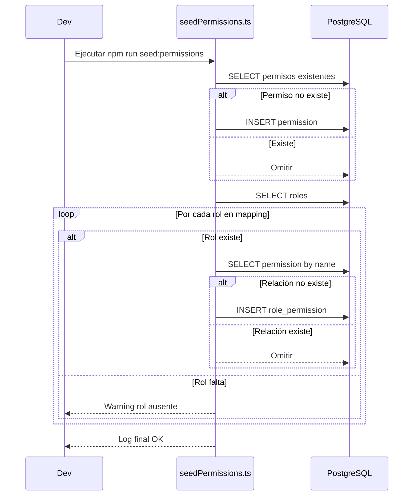

# Guía de Seeding (Roles y Permisos)

Esta guía describe cómo inicializar datos base relacionados a Roles y Permisos de forma **idempotente**, segura y repetible.

## Objetivos

- Asegurar catálogo consistente de permisos (CorePermission).
- Asignar permisos base a roles preexistentes.
- Facilitar despliegues y entornos efímeros (CI, review apps, contenedores descartables).

## Componentes

| Componente                     | Rol                  | Fuente                         |
| ------------------------------ | -------------------- | ------------------------------ |
| `CorePermission` (enum)        | Catálogo de acciones | Código TS                      |
| `DefaultRolePermissionMapping` | Mapeo rol→permisos   | Código TS                      |
| `seedPermissions.ts`           | Script idempotente   | `src/infrastructure/bootstrap` |

## Ejecución Rápida

```bash
npm run seed:permissions
```

Requisitos previos:

1. Migraciones/estructura listas (tablas `permissions`, `roles`, `role_permissions`).
2. Roles base insertados (p.ej. `admin`, `artist`, `common_user`).
3. Variables de entorno de la conexión Postgre configuradas.

## Flujo Lógico



## Idempotencia

Características que permiten re-ejecutar sin efectos adversos:

- Verificación de existencia por `name` antes de insertar permiso.
- Verificación de relación (role+permission) antes de crear asignación.
- Warn y continuar si falta un rol (no aborta proceso).

## Extensiones Sugeridas

- `seed:roles` para crear roles base si no existen.
- `seed:demo` para insertar usuarios de prueba con roles preasignados.
- Integrar en pipeline CI: paso previo a tests de integración (y limpiar DB después).
- Añadir auditoría (tabla `seed_runs`).

## Estrategia de Cambios Evolutivos

| Cambio            | Acción                                              | Notas                            |
| ----------------- | --------------------------------------------------- | -------------------------------- |
| Nuevo permiso     | Añadir a enum + mapping                             | Re-ejecutar script               |
| Quitar permiso    | Eliminar de mapping + (opcional) DELETE manual      | Revisar dependencias de código   |
| Renombrar permiso | Crear nuevo + migrar usos + (opcional) borrar viejo | Evitar side effects en histórico |

## Diagnóstico Rápido (Checklist)

- ¿Permiso falta? -> Confirmar aparece en `CorePermission` y no hay typo.
- ¿Asignación no creada? -> Verificar rol existe y coincide el nombre del mapping.
- ¿Script falla conexión? -> Revisar `.env` y privilegios DB.
- ¿Roles sin permisos en JWT? -> Confirmar login se ejecuta tras seeding; limpiar token antiguo.

## Integración con Otros Scripts (Ejemplo)

```jsonc
// package.json
{
  "scripts": {
    "migrate": "ts-node ./scripts/runMigrations.ts",
    "seed:roles": "ts-node ./scripts/seedRoles.ts",
    "seed:permissions": "ts-node src/infrastructure/bootstrap/seedPermissions.ts",
    "setup:dev": "npm run migrate && npm run seed:roles && npm run seed:permissions && npm run dev",
  },
}
```

## Buenas Prácticas Operativas

1. Ejecutar seeds siempre después de migraciones y antes de arrancar servicios que dependan de permisos.
2. Versionar cualquier cambio de catálogo junto a la funcionalidad que lo usa.
3. Evitar seeds “on boot” en producción salvo que exista bloqueo de concurrencia.
4. Validar en staging antes de producción (scripts no deben degradar performance inicial).

## Seguridad

- El script no borra permisos huérfanos automáticamente para evitar pérdidas accidentales.
- Para limpieza: generar script de mantenimiento manual supervisado.

## Troubleshooting

| Problema                    | Causa Probable                              | Solución                             |
| --------------------------- | ------------------------------------------- | ------------------------------------ |
| Permisos vacíos tras seed   | Conexión distinta / schema distinto         | Revisar `DB_SCHEMA` y logs           |
| Warnings de roles faltantes | Roles no creados todavía                    | Ejecutar seed de roles primero       |
| Duplicados inesperados      | Cambio manual directo en DB sin constraints | Verificar unique index y constraints |

---

Fin de la Guía de Seeding.
