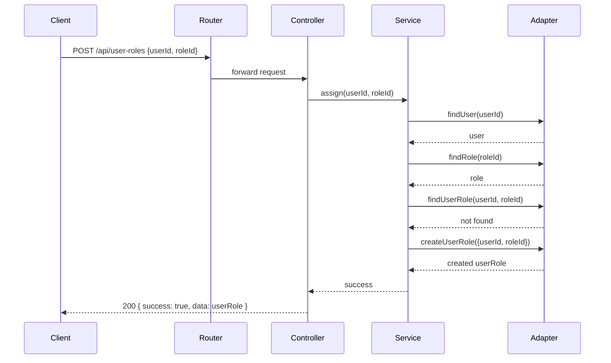
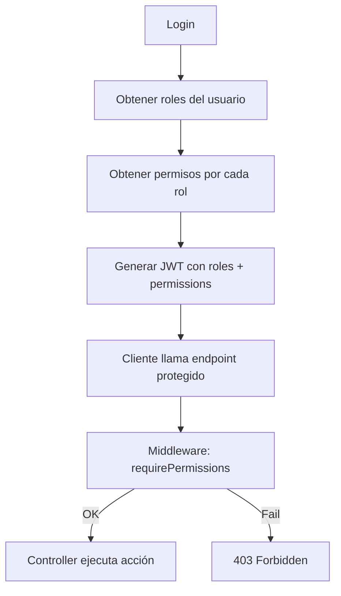

# Módulo: Roles

## Propósito

Agrupar permisos asignables a usuarios para control de acceso (RBAC). El objetivo es reemplazar flags sueltos (por ejemplo `is_artist`) por roles y permisos más explícitos y extensibles.

## Modelo de datos

- `Role`: `id`, `name` (único), `description`, `created_at`
- `UserRole`: `id`, `user_id`, `role_id`, `created_at`

Estas tablas mantienen una relación many-to-many entre `users` y `roles` a través de `user_roles`.

## Dónde se maneja en el código

- Router: `infrastructure/router/UserRoleRouter.ts`
- Controller: `infrastructure/controller/UserRoleController.ts`
- Service: `application/services/UserRoleService.ts`
- Entity / Adapter: `infrastructure/entities/UserRoleEntity.ts`
- Seeding: `infrastructure/bootstrap/seedPermissions.ts` (mapea roles a permisos iniciales)

Los archivos anteriores son los puntos de entrada y lógica para crear, asignar y eliminar roles.

## Flujo: Asignar un rol a un usuario (paso a paso)

1. Petición cliente: `POST /api/user-roles` con body `{ userId, roleId }`.
2. Router valida formato y pasa al controller.
3. `UserRoleController` llama a `UserRoleService.assign(userId, roleId)`.
4. `UserRoleService` valida existencia de `user` y `role` mediante los adaptadores de data.
5. Si la relación no existe, crea el registro en `user_roles` (idempotente).
6. Se actualiza (o se invalida) cualquier cache en memoria si aplica.
7. Respuesta `200` con la relación creada o `409/400` si hay conflicto.

### Diagrama (Sequence - Mermaid)



## Endpoints (resumen)

- `POST /api/roles` — Crear rol (admin)
- `GET /api/roles` — Listar roles
- `GET /api/roles/:id` — Obtener rol
- `PUT /api/roles/:id` — Actualizar rol
- `DELETE /api/roles/:id` — Eliminar rol
- `POST /api/user-roles` — Asignar rol a usuario (body: `userId`, `roleId`)
- `DELETE /api/user-roles/:userId/:roleId` — Remover rol de usuario
- `GET /api/user-roles/roles/:userId` — Roles de usuario
- `GET /api/user-roles/users/:roleName` — Usuarios por rol

Ejemplo request (assign):

```http
POST /api/user-roles
Content-Type: application/json

{ "userId": 42, "roleId": 2 }
```

Respuesta:

```json
{ "success": true, "data": { "id": 123, "user_id": 42, "role_id": 2 } }
```

## Flujo: Login y cómo se reflejan los roles

1. El usuario hace `POST /login`.
2. `AuthService` obtiene los `roles` del usuario (consulta `user_roles`).
3. A partir de los roles, se recuperan los permisos asociados (`role_permissions`) y se "flatten" en la lista de `permissions`.
4. El JWT contiene ambos arrays: `roles` y `permissions`.

JWT ejemplo:

```json
{
  "id": 42,
  "username": "juan",
  "roles": ["common_user", "artist"],
  "permissions": ["user.read", "artist.update"]
}
```

## Integración con permisos y autorización

- Los roles actúan como colecciones de permisos (many-to-many con `role_permissions`).
- El middleware `requirePermissions(...)` valida que el token (o la consulta de permisos en base de datos) contenga los permisos requeridos.
- Cambios a roles o permisos deben refrescarse en token/re-auth si se espera efecto inmediato.

### Diagrama (Flow - Mermaid) asignación y autorización simplificado:



## Errores comunes y códigos

- `409` Nombre de rol duplicado en creación.
- `404` Rol o usuario no encontrado en operaciones de asignación/remoción.
- `400` Body inválido o IDs no numéricos.

## Buenas prácticas

- Usar nombres estables para roles (ej: `admin`, `artist`, `common_user`).
- No hardcodear comportamiento en la entidad `User` (evitar flags como `is_artist`).
- Mantener sincronizado el `seedPermissions.ts` con `CorePermission` y `DefaultRolePermissionMapping`.
- En sistemas con alta necesidad de consistencia, considerar invalidar sessions o tokens al cambiar roles críticos.
